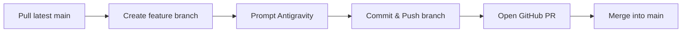

# Exam-Buddy — Multi-Device 3-Member Team Setup Guide

This guide explains how **3 team members working from 3 different devices and Antigravity accounts** can collaborate simultaneously on the **Exam-Buddy** project without code clashing or git conflicts.

---

## 1. One-Time Setup: GitHub Repository Owner (Device 1)

Before Member 2 and Member 3 can push their work:

1. **Add Team Members as Collaborators:**
   - Go to [GitHub Repository Settings > Collaborators](https://github.com/jarvis-lab07/Exam-Buddy/settings/access).
   - Click **Add people**.
   - Enter the GitHub usernames or emails of Member 2 and Member 3.
   - Have them accept the invitation email or invitation banner on GitHub.

2. *(Recommended)* **Protect the `main` branch:**
   - In GitHub: Go to **Settings > Branches**.
   - Add a branch protection rule for `main`.
   - Check **Require a pull request before merging**. This prevents accidental direct pushes to `main`.

---

## 2. Onboarding Steps for Device 2 and Device 3

Each new team member should run these steps once on their machine:

### Step 1: Clone the Repository
```bash
git clone https://github.com/jarvis-lab07/Exam-Buddy.git
cd Exam-Buddy
```

### Step 2: Set Git Identity (Crucial for proper commit credit)
```bash
git config user.name "Your Name"
git config user.email "your-email@example.com"
```

### Step 3: Install Frontend Dependencies
```bash
cd frontend
npm install
```

### Step 4: Set up Environment Variables
```bash
cp .env.example .env.local
```

### Step 5: Verify the Dev Server
```bash
npm run dev
```
Open [http://localhost:3000](http://localhost:3000) in your browser to verify the app runs.

### Step 6: Open in Antigravity IDE
Open the `Exam-Buddy` root folder in Antigravity. Antigravity will automatically read `GEMINI.md` and adhere to team standards!

---

## 3. Daily Collaboration Workflow (Simultaneous Work)

Whenever you start working on a task, follow this standard flow:



### Step 1: Update your local `main`
Always pull the latest changes from other members before starting:
```bash
git checkout main
git pull origin main
```

### Step 2: Create your own feature branch
**Never write code on `main`.** Create a branch using your name and task:
```bash
git checkout -b feature/<yourname>-<task-name>
```
*Examples:*
- `feature/durgesh-landing-page`
- `feature/alex-quiz-engine`
- `feature/sarah-analytics-dashboard`

### Step 3: Prompt Antigravity
Prompt Antigravity to build or adjust features. Antigravity can write code, test components, and install libraries for you.

### Step 4: Commit and Push your branch
```bash
git add .
git commit -m "feat: implement quiz timer and navigation"
git push -u origin feature/<yourname>-<task-name>
```

### Step 5: Open a Pull Request (PR) on GitHub
1. Go to [https://github.com/jarvis-lab07/Exam-Buddy/pulls](https://github.com/jarvis-lab07/Exam-Buddy/pulls).
2. Click **New pull request**.
3. Select your branch into `main`.
4. Review changes with your team and click **Merge pull request**.

### Step 6: Update Local Branches
Once merged, all 3 devices can update their local `main`:
```bash
git checkout main
git pull origin main
```

---

## 4. Recommended Task Division (Zero Merge Conflicts)

To avoid editing the same files at the exact same moment, divide the initial modules across the 3 members:

| Member | Primary Focus | Key Files / Folders |
| :--- | :--- | :--- |
| **Member 1 (Lead)** | Landing Page & Navigation Header/Footer | `frontend/src/app/page.tsx`, `src/components/layout/` |
| **Member 2** | Quiz / Exam Interface & Timer | `frontend/src/app/quiz/page.tsx`, `src/components/quiz/` |
| **Member 3** | Results, Scorecard & Topic Analytics | `frontend/src/app/results/page.tsx`, `src/components/results/` |

---

## 5. Helpful Antigravity Prompts for Team Members

When working in Antigravity, you can use prompts like:
- *"Create a feature branch named `feature/<myname>-<task>` and switch to it."*
- *"Check if there are any git conflicts with origin/main and help me resolve them."*
- *"Build the component for [X] inside `src/components/[X].tsx` matching our Tailwind styling in `GEMINI.md`."*
- *"Stage all changes, commit with message '[message]', and push to my remote branch."*
